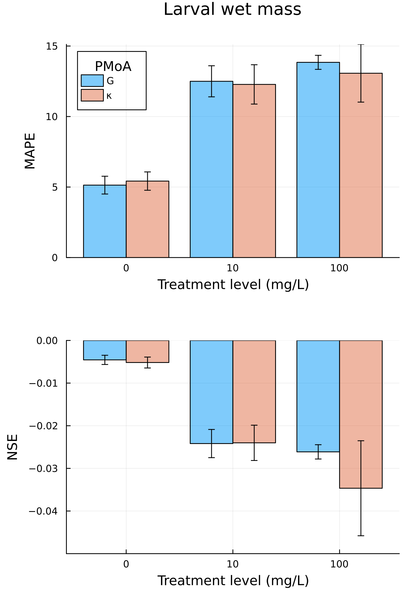

## Bootstrapping procedure

The mean absolute percentage error (MAPE) and Nash-Sutcliffe-Efficiency (NSE) 
were calculated for each fitted or predicted response and each test concentration. 

A bootstrapping procedure was implemented that yields the confidence intervals of MAPE and NSE, resulting from variability in model output due to the simulated individual variability. In each case, we performed 2,000 bootstrap resamplings (n = 100 per bootstrap sample) from 100 simulation runs 
and calculated MAPE and NSE for each bootstrap sample. 
Observations which resulted in missing values for were discarded in the calculation of MAPE and NSE. 
This is possible, e.g. if there are no tadpoles left in the simulations for which wet mass could be calculated at a time-point where a non-zero number of tadpoles has been observed.
We then calculated the confidence intervals as the 5th and 95th percentile of MAPE and NSE values across bootstrap samples. 

## 2,4-D

## Flupyradifurone

::: {#fig-flupy-calib layout-ncol=2}

{#fig-flpcalibwetmass}
{#fig-flpcalibfracttadpoles}

Quantitative metrics for each tested PMoA of Flupyradifurone in the calibration data. Error bars indicate 5 - 95% credible intervals, 
obtained from 2,000 bootstrap samples. Confidence intervals reflect model stochasticity, not parameter uncertainty. 

:::
