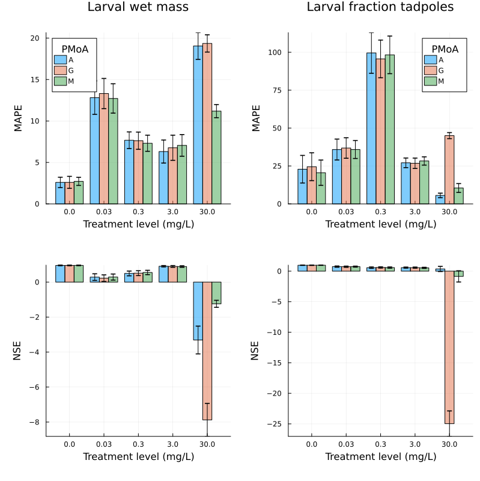
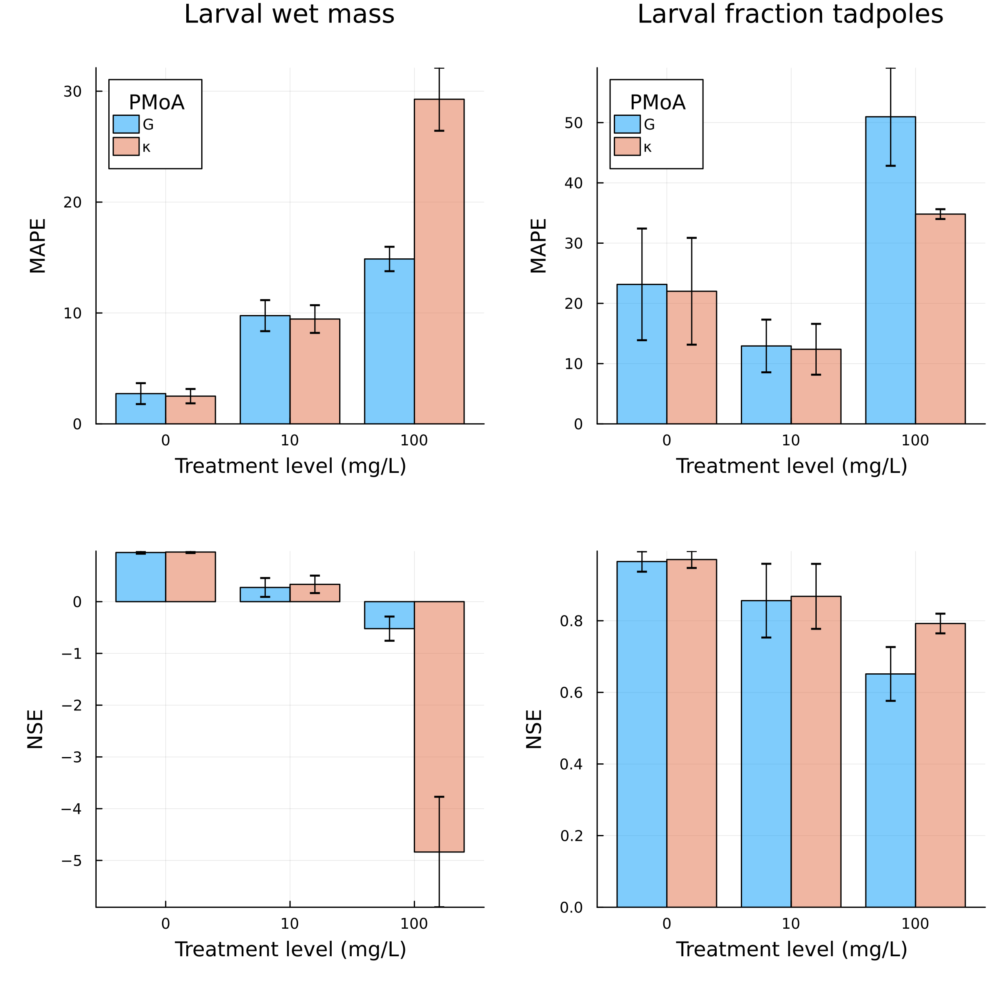

## Choice and interpretation of metrics

We report mean absolute percentage error (MAPE) and Nash-Sutcliffe-Efficiency (NSE) as additional metrics. 
They are defined as:

```{=latex}
\begin{align*}
MAPE &= 100 \cdot \left[ \sum\limits_{i=1}^{n} \left( \dfrac{\hat{y}_i - y_i}{y_i} \right) n^{-1}  \right] \\
NSE &= 1 - \left[ \dfrac{\sum\limits_{i=1}^{n} \left( y_i - \hat{y}_i \right)^2 }{\sum\limits_{i=1}^{n} \left( y_i - \overline{y} \right)^2} \right]
\end{align*}
```

where $\hat{y_i}$ is the $i$th simulated value and $y_i$ is the $i$th observed value.
$\overline{y}$ is the mean of observed values.

MAPE and NSE highlight two slightly different aspects of model performance.
While MAPE is useful to quantify the overall average deviation, 
$NSE$ compares the sum of squares with the observed mean. 
When calculated for individual time-series, this means that NSE puts more focus on the temporal dynamics. \\
However, both metrics assume independence of observations, which is relevant when the plausibility of temporal dynamics produced by alternative models is more important than differences in average deviation.
This is why the metrics are presented here as supporting information, 
whereas the model selection in the main text is largely based on visual comparison. 

## Bootstrapping procedure

The mean absolute percentage error (MAPE) and Nash-Sutcliffe-Efficiency (NSE) 
were calculated for each fitted or predicted response and each test concentration. 

A bootstrapping procedure was implemented that yields the confidence intervals of MAPE and NSE, resulting from variability in model output due to the simulated individual variability. 
In each case, we performed 2,000 bootstrap resamplings (n = 100 per bootstrap sample) from 100 simulation runs and calculated MAPE and NSE for each bootstrap sample. 
Observations which resulted in missing values for were discarded in the calculation of MAPE and NSE. 
This is possible, e.g. if there are no tadpoles left in the simulations for which wet mass could be calculated at a time-point where a non-zero number of tadpoles has been observed.
We then calculated the confidence intervals as the 5th and 95th percentile of MAPE and NSE values across bootstrap samples. 

## 2,4-D





## Flupyradifurone

{#fig-flp-calib width=80%}
